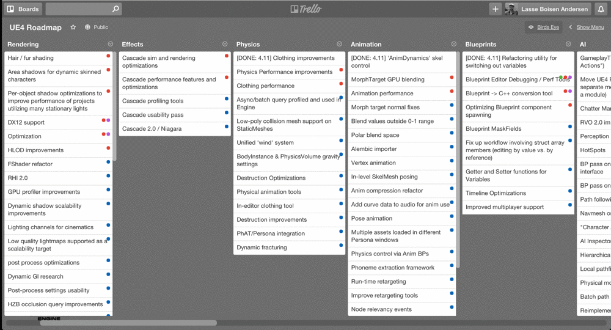

# Trello Birds-eye View

> Chrome Extension for minimalistic board/card styling giving you a birds-eye view in Trello

**Why?**
Trello is great, but if you have a lot of cards on your boards, the interface becomes a mess. Too much bulky chrome, borders, margins and paddings. Wouldn't you sometimes wish you could just chip away all the unnecessary junk?

**How?**
This small Chrome Extension adds an extra button to the Trello toolbar. Click it and you get more than *50% more actual content on your screen*. Yes, 50 fucking percent.

## Install

[**Add the extension to Chrome** from the webstore](https://chrome.google.com/webstore/detail/trello-birdseye/jddlcajmgfdpfnekdppnapoldfhabkeg)

That's it. Look for the "Birds Eye" button in the boards toolbar in Trello :+1: